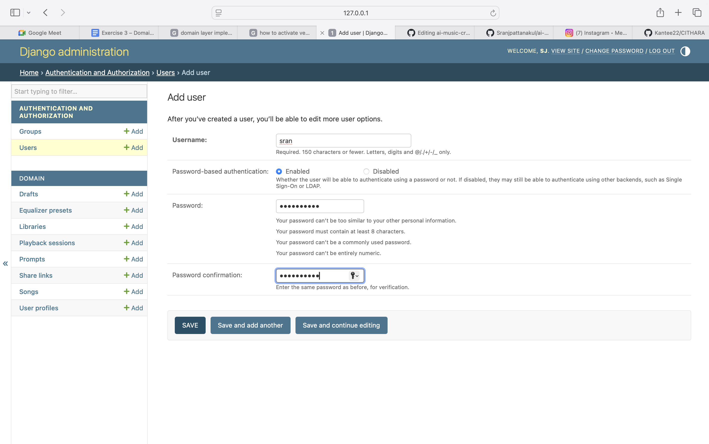
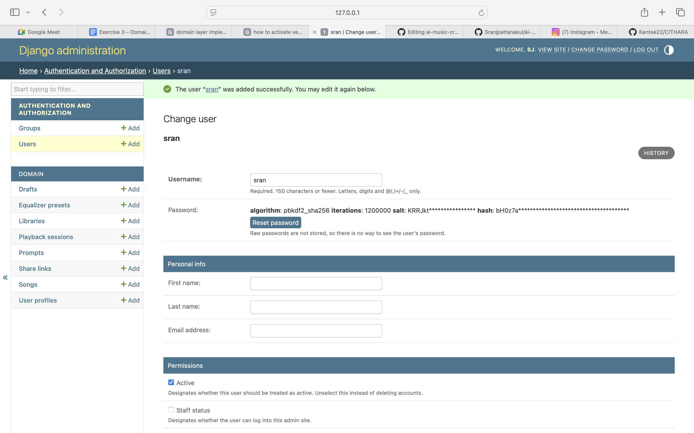
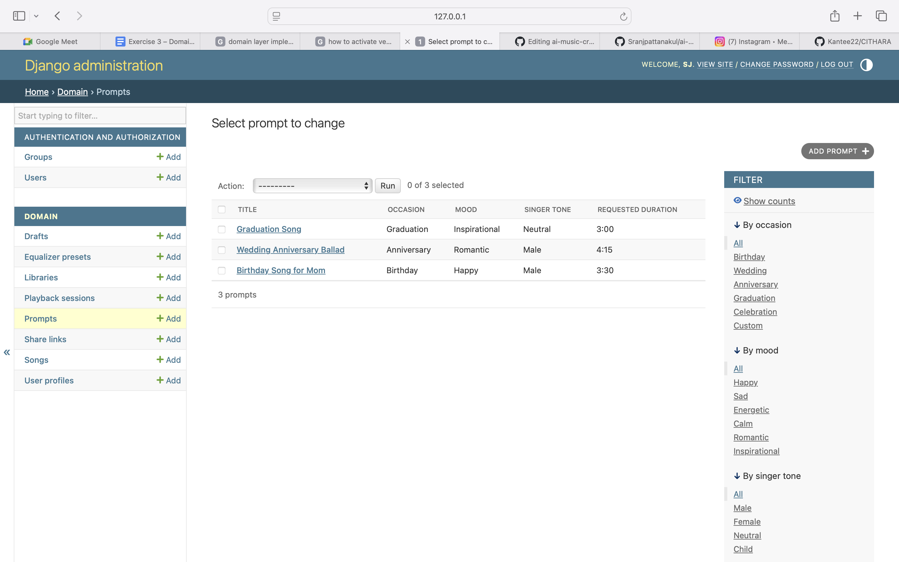
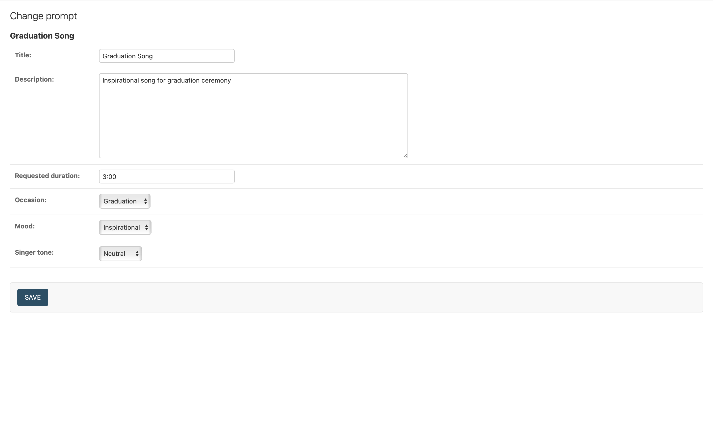
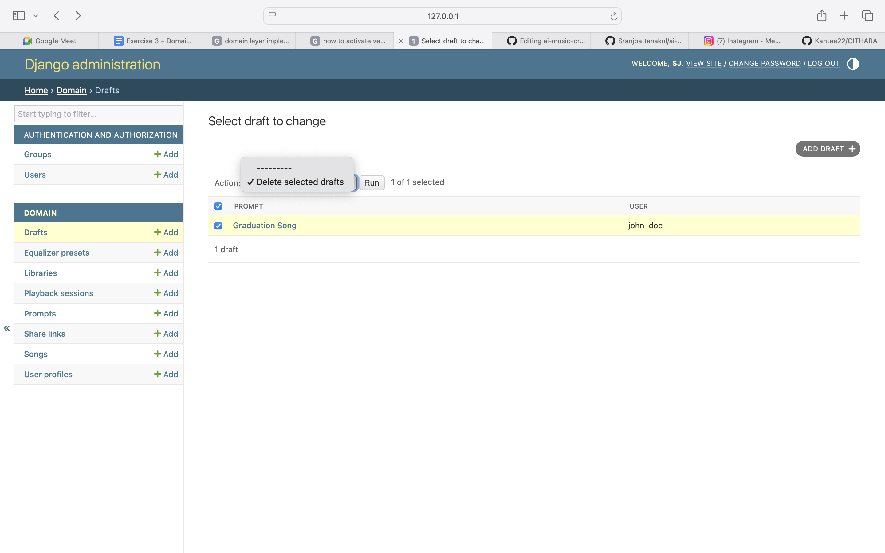
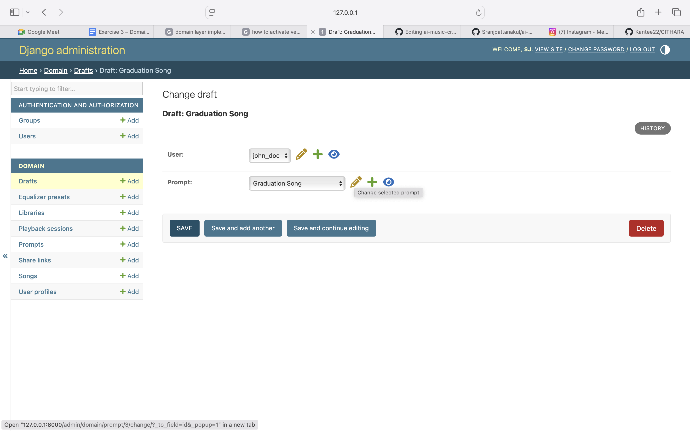

# AI Music Creator Platform

## Project Overview
This project implements an AI Music Creator Platform using Django.
It builds progressively across exercises — from a domain layer (Exercise 3) to a full strategy-based song generation system (Exercise 4).

---

# Exercise 3 – Domain Layer Implementation

## Overview
Exercise 3 implements the domain layer for the AI Music Creator Platform using Django ORM.
It translates the domain model from Exercise 2 into a working database schema with full CRUD functionality.

## Setup Instructions

### Prerequisites
- Python 3.12+
- pip

### Installation

1. Clone the repository
```bash
git clone https://github.com/Sranjpattanakul/ai-music-creator.git
cd ai-music-creator
```

2. Create and activate virtual environment
```bash
python -m venv venv
source venv/bin/activate  # On Windows: venv\Scripts\activate
```

3. Install dependencies
```bash
pip install django
```

4. Run migrations
```bash
python manage.py migrate
```

5. Create superuser
```bash
python manage.py createsuperuser
```

6. Start development server
```bash
python manage.py runserver
```

7. Access Django Admin
```
http://127.0.0.1:8000/admin
```

---

## Creating a User (Important)

Since this project extends Django's built-in User model with `UserProfile`,
creating a user is a two-step process:

### Step 1: Create the Django User
1. Go to **Authentication and Authorization → Users → Add User**
2. Fill in username and password
3. Click **"Save and continue editing"** ← important, do NOT click "Save" yet
4. On the next page, fill in additional fields (email, first name, last name)
5. Click **Save**

### Step 2: Create the UserProfile
1. Go to **Domain → User profiles → Add User Profile**
2. Select the user you just created
3. Fill in `google_id`
4. Click **Save**

> **Note:** UserProfile extends the built-in Django User to store additional
> domain-specific information. Both records must exist for a complete user entity.

---

## Domain Model Entities

| Entity | Description |
|---|---|
| **User** | Django's built-in User model |
| **UserProfile** | Extends User with `google_id` |
| **Library** | User's personal song collection |
| **Song** | AI-generated music with metadata |
| **Prompt** | Parameters used for song generation |
| **Draft** | Saved prompts not yet submitted for generation |
| **ShareLink** | Shareable links for songs |
| **PlaybackSession** | Tracks the user's current playback state |
| **EqualizerPreset** | Saved audio equalizer settings |

> **Note:** `GenerationJob` was removed from the domain model based on TA feedback
> as it was considered over-modeling for this stage.

---

## Domain Relationships

| Relationship | Type |
|---|---|
| User → UserProfile | One-to-One |
| User → Library | One-to-One |
| Library → Songs | One-to-Many |
| Song → Prompt | One-to-One |
| User → Drafts | One-to-Many |
| User → ShareLinks | One-to-Many |
| Song → ShareLink | One-to-Many |
| User → PlaybackSession | One-to-One |
| User → EqualizerPresets | One-to-Many |

---

## CRUD Operations

All CRUD operations are available through the Django Admin interface at `/admin`.

- **Create** – Click **"Add"** next to any entity in the admin panel
- **Read** – Click on any entity name to view the list of records
- **Update** – Click on any record to open and edit it, then click **Save**
- **Delete** – Open a record and click the **Delete** button at the bottom

---

## Test Data

| Entity | Records |
|---|---|
| User | 1 (john_doe) |
| UserProfile | 1 |
| Library | 1 |
| Prompts | 3 (Birthday Song for Mom, Wedding Anniversary Ballad, Graduation Song) |
| Songs | 3 (Happy Birthday Mom, Forever Together, Summer Vibes) |
| Drafts | 1 (Draft: Graduation Song) |
| ShareLinks | 1 (Share link for Happy Birthday Mom) |
| PlaybackSessions | 1 (john_doe's playback) |
| EqualizerPresets | 1 (Bass Boost) |

---

## Screenshots

### Create
**Creating a new User (Step 1 - Username & Password)**


**Creating a new User (Step 2 - Save and continue editing)**


### Read
**Prompts list view showing all 3 persisted records**


### Update
**Editing an existing Prompt (Graduation Song)**


### Delete
**Selecting a Draft with delete action**


**Delete button on Draft detail view**


---

## Database

SQLite is used as the development database (`db.sqlite3`).
Migration files are committed to the repository to ensure the schema can be reproduced exactly.

---

## Notes (Exercise 3)

- `GenerationJob` was removed from the domain model based on TA feedback (over-modeling)
- All relationships from Exercise 2 domain model are correctly implemented
- Duration validation is applied on Song (valid range: 2:00 – 6:00 minutes)
- This implementation intentionally focuses on the domain layer only

---

---

# Exercise 4 – Strategy Pattern (Mock vs Suno API)

## Overview

Exercise 4 applies the **Strategy design pattern** to implement multiple interchangeable song-generation behaviors, building on the domain layer from Exercise 3.

Two strategies are implemented:
1. **Mock strategy** — offline, deterministic, no API calls required
2. **Suno API strategy** — real AI generation via SunoApi.org

---

## Additional Setup for Exercise 4

### 1. Install additional dependencies

```bash
pip install django requests python-dotenv
```

### 2. Create a `.env` file

```bash
cp .env.example .env
```

```env
SECRET_KEY=your-django-secret-key
DEBUG=True
GENERATOR_STRATEGY=mock
SUNO_API_KEY=your_api_key_here
GOOGLE_CLIENT_ID=your_google_client_id
GOOGLE_CLIENT_SECRET=your_google_client_secret
```

**Never commit `.env`** — it contains secrets. Only `.env.example` is committed.

### 3. Apply migrations and run

```bash
python manage.py migrate
python manage.py runserver
```

Open `http://localhost:8000` — log in with Google or use the demo login.

---

## Strategy Pattern Implementation

### Strategy Interface

Defined in `app/strategies/base.py`:

```python
class SongGeneratorStrategy(ABC):
    @abstractmethod
    def generate(self, request: GenerationRequest) -> GenerationResult:
        ...

    @abstractmethod
    def get_status(self, task_id: str) -> GenerationResult:
        ...
```

### Running in Mock Mode (Offline)

Set in `.env`:

```env
GENERATOR_STRATEGY=mock
```

No API key or internet connection required. Returns a deterministic result instantly.

**Example output:**
```json
{
  "success": true,
  "task_id": "mock-5052fcbc",
  "status": "SUCCESS",
  "audio_url": "https://www.soundhelix.com/examples/mp3/SoundHelix-Song-1.mp3"
}
```

### Running in Suno Mode (Live API)

Set in `.env`:

```env
GENERATOR_STRATEGY=suno
SUNO_API_KEY=your_api_key_here
```

Calls `POST https://api.sunoapi.org/api/v1/generate`, stores the returned `taskId`, and polls for status until `SUCCESS` or `FAILED`.

**Example output (initial response):**
```json
{
  "success": true,
  "task_id": "f3ac02ded1b961f27f83acdd9a468c4f",
  "status": "QUEUED",
  "audio_url": null
}
```

Status flow: `QUEUED` → `GENERATING` → `SUCCESS` / `FAILED`

### Strategy Selection

Centralized in `app/strategies/factory.py` — no scattered `if/else` in controllers:

```python
def get_generator(strategy: str = None) -> SongGeneratorStrategy:
    if not strategy:
        strategy = getattr(settings, 'GENERATOR_STRATEGY', 'mock')
    if strategy.lower() == 'suno':
        return SunoSongGeneratorStrategy()
    return MockSongGeneratorStrategy()
```

---

## API Endpoints

| Method | URL | Description |
|--------|-----|-------------|
| `POST` | `/api/generation/generate/` | Submit a song generation request |
| `GET` | `/api/generation/status/<task_id>/` | Poll generation status |
| `PATCH` | `/api/library/<user_id>/songs/<song_id>/favorite/` | Toggle favorite |
| `DELETE` | `/api/library/<user_id>/songs/<song_id>/delete/` | Delete song |
| `POST` | `/api/browse/<user_id>/songs/<song_id>/share/` | Create share link |
| `POST` | `/api/library/<user_id>/drafts/save/` | Save draft |
| `DELETE` | `/api/library/<user_id>/drafts/<draft_id>/delete/` | Delete draft |

---

## Author

Name: `Sran Jarurangsripattanakul`  
Course: Principle of Software Design  
Exercise 3: Domain Layer Implementation  
Exercise 4: Strategy Pattern for Song Generation
